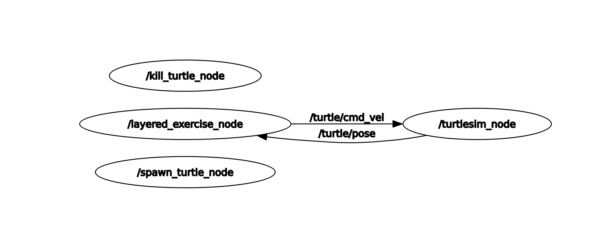
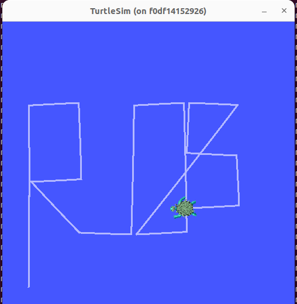

# Turtle moved to ROS2

Lemme pause my Chess game right there and move on to my newly assigned task i.e. migrating ROS1 package to ROS2 which Davide found and guarantees that it is super cool to add it in the current stack. 

But before I start this migration, I need to make sure that this ROS1 package works on my machine. Once I made sure that this package works on my Macbook M1 chip, I moved on slowly to develop bit by bit to ROS2. There are couple of things which I needed to be sure about: package manifests, messages, services, building system, and finally updating source code. In terms of documentation, I referred to migration guide provided by ros to migrate from ROS1 to ROS2. I recommend using this documentation also for further migrations.

During this migration, following are some changes which I did:
1. updating package.xml file to ros2 standards.
2. updating CMakeLists.txt file to ros2 standards.
3. Updating launch file from xml format to ROS2 python format.
4. Finally updating node which I call layered_exercise node.

During the migration, I faced several changes. Following are list of those:
1. Visualizing ROS1 turtle with Macbook M1 chip looks quite straightforward but when it comes to visualizing with ROS2 based package, I faced some challenges. I spend quite some time on visualization of ROS2 package on my Macbook but nothing was succesful. Therefore, I switched to an Ubuntu based machine since Ubuntu is used by all Layered empolyees. On moving to Ubuntu, visualization worked immediately. HURRAYYY!

2. Migration from rosservices to ROS2 services. On migrating from rosservices to ROS2 based services such as kill and spawn, I faced some issues. With ROS1, you could mention services in launch file. However, it's a bit tricky to run ROS2 services using launch command. In order to solve this challenge, I decided to make 2 new nodes called kill_turtle_node and spawn_turtle_node. These two nodes make sure that once turtlesim creates turtle1 topic, kill_turtle_node deletes turtle1 and spawn_turtle_node generated a new turtle and plave it to an initial position. Once killing turtle1 and spawning a new turtle in the scene, it then initiates layered_exercise_node which then takes care of updating turtle's position and move the turtle in the scene.

Shown below is an rqt_graph of our new ROS2 package:


As shown in figure above, our ROS2 based package has 4 nodes:
1. turtlesim_node: Responsible for gui, placing initial turtle1 at a position. It subscribes to turtle/cmd_vel topic and publishes on turtle/pose topic.
2. kill_turtle_node: A client based service which is implemented as a node. It kills turtle1 topic which was intially generated by default by turtlesim_node.
3. spawn_turtle_node: A client based service which is implemented as a node. It creates turtle topic and place the new turtle into a new initial position.
4. layered_exercise_node: This is where magic happens! Layered exercise subscribe to turtle/pose topic and use this information to calculate updated position and angular velocity of the turtle. It then publish this information to turtle/cmd_vel topic. 

Now that we understand how our new ROS2 based system works, let's see how we can run it:

1. Asumption: Usage of Ubuntu based machine with xhost installed.
2. In your terminal, first make sure if DISPLAY variable is setup using command ```echo $DISPLAY```. If it does not show anything, please set it up as follows:
```
export DISPLAY=:1
``` 
3. Enable root user (docker root in later stage) to access running X server to access display.
```
xhost local:root
``` 
4. Clone the github repository:
```
git clone https://github.com/rupalsaxena/layered_exercise.git
```
5. Run docker container using the command below:
```
docker run -it --rm --env DISPLAY=$DISPLAY --volume /tmp/.X11-unix:/tmp/.X11-unix:rw --volume $(pwd):/root/colcon/src --name ros2_container osrf/ros:humble-desktop
```
6. Once you are inside docker, run the following command:
```
cd root/colcon && colcon build && source install/setup.bash
```
7. Launch the solution of exercise:
```
ros2 launch rosp_layered_exercise turtle.launch.py
```

Once you run the launch file, you should be able to see a screen as shown below and a turtle moving and writing ROS.



Phew! Now that we are done for this task, I can go back to my chess game again!